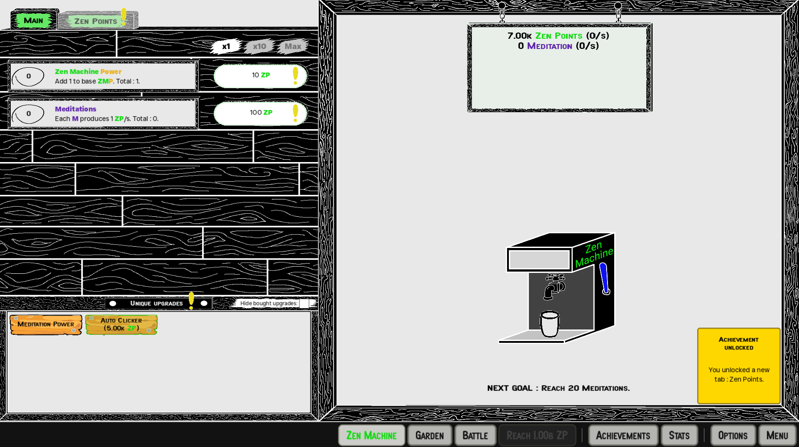

# ZenIdle

This is a little idle game developped with Godot Engine. Currently, this project is not complete and is on Pause state.

To play the game, follow [this link](https://github.com/Arawyn42/ZenIdle/releases/) and download the .exe (for Windows users) or the .x86_64 (for linux users) in the **Assets** section.

## Currently working:
- Zen Machine Tab
- Options Tab
- Transcendance Tab
- Transcendance Reset
- Save / Load games
- Achievements and goals display

## Not implemented yet:
- Achievements Tab
- Stats Tab
- Menu Tab
- Garden Tab
- Battle Tab

The game and its graphics were made by me, David Renassia, and are not free of use.
